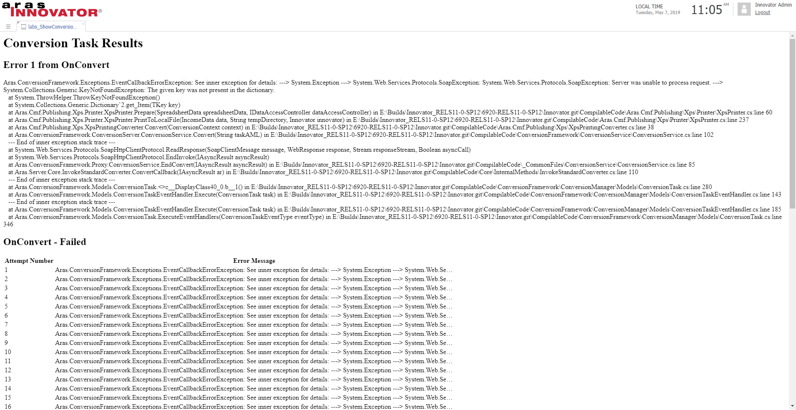

# Show Conversion Task Errors

This project adds an Item Action to the Conversion Task ItemType that allows administrators to quickly pull up a one-window view to see the error(s) thrown when a Conversion Task fails. The way to do this in an OOTB database is to open up several levels of relationships until you can see the error message. The goal for this project is to show display all of the information a user will want to see about the failure in one action.

*The errors of an example Conversion Task being displayed with this project.*

## Project Details

Release | Notes
--------|--------
[v1.0.0](https://github.com/ArasLabs/show-conversion-task-errors/releases/tag/v1.0.0) | Initial release

#### Supported Aras Versions

Project | Aras
--------|------
[v1.0.0](https://github.com/ArasLabs/show-conversion-task-errors/releases/tag/v1.0.0) | 11.0 SP15, 11.0 SP12

## Installation

#### Important!
**Always back up your code tree and database before applying an import package or code tree patch!**

### Pre-requisites

1. Aras Innovator installed (version 11.0 SP12+ preferred)
2. Aras Package Import tool
3. Show Conversion Task Errors import package

### Install Steps

1. Backup your database and store the BAK file in a safe place.
2. Open up the Aras Package Import tool.
3. Enter your login credentials and click **Login**
  * _Note: You must login as root for the package import to succeed!_
4. Enter the package name in the TargetRelease field.
  * Optional: Enter a description in the Description field.
5. Enter the path to your local `..\show-conversion-task-errors\Import\imports.mf` file in the Manifest File field.
6. Select **aras.labs.ShowConversionTaskErrors** in the Available for Import field.
7. Select Type = **Merge** and Mode = **Thorough Mode**.
8. Click **Import** in the top left corner.
9. Close the Aras Package Import tool.

You are now ready to login to Aras and try out this new action.

## Usage

1. Login as **admin** or another user with permission to see Conversion Tasks
2. Find a Conversion Task that has failed
3. Right-click on this task and select **Show Conversion Error**

In the resulting view, the first error will be displayed at the top of the window. You can also scroll down to see the which events succeeded or failed as well as how many times an event has failed.

## Contributing

1. Fork it!
2. Create your feature branch: `git checkout -b my-new-feature`
3. Commit your changes: `git commit -am 'Add some feature'`
4. Push to the branch: `git push origin my-new-feature`
5. Submit a pull request

## Credits

Project written, documented, and published by Christopher Gillis at Aras Labs. @cgillis-aras

## License

Aras Labs projects are published to Github under the MIT license. See the [LICENSE file](./LICENSE.md) for license rights and limitations.